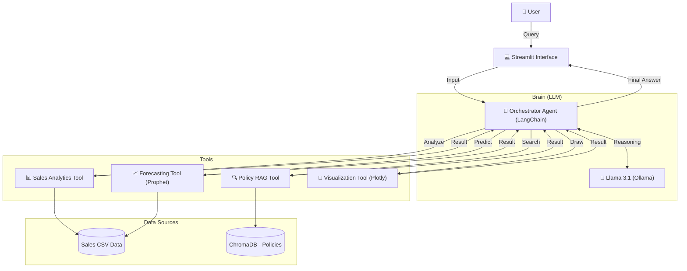

# 🧭 BizNavi: E-Commerce Intelligent Operations Assistant

> **Data-Driven Operations AI Agent for E-Commerce**
> Analyze complex sales data, search operational policies (RAG), and forecast demand with a single conversational interface.

---

## 🏗️ System Architecture

BizNavi utilizes a **LangChain-based Agent Architecture** to interpret user intent and route queries to the appropriate tools.


```mermaid
graph TD
    User["👤 User"] -->|Query| UI["💻 Streamlit Interface"]
    UI -->|Input| Agent["🤖 Orchestrator Agent (LangChain)"]
    
    subgraph "Brain (LLM)"
        Agent <-->|Reasoning| LLM["🦙 Llama 3.1 (Ollama)"]
    end

    subgraph "Tools"
        Agent -->|Analyze| T1["📊 Sales Analytics Tool"]
        Agent -->|Search| T2["🔍 Policy RAG Tool"]
        Agent -->|Predict| T3["📈 Forecasting Tool (Prophet)"]
        Agent -->|Draw| T4["🎨 Visualization Tool (Plotly)"]
    end

    subgraph "Data Sources"
        T1 --> CSV[("Sales CSV Data")]
        T2 --> VectorDB[("ChromaDB - Policies")]
        T3 --> CSV
    end
    
    T1 & T2 & T3 & T4 -->|Result| Agent
    Agent -->|Final Answer| UI

```

---

## 🚀 Key Features

### **💬 Operations Copilot (Chat Assistant)**: 
* An intelligent chat interface powered by LangChain and Llama 3.1. 
* **Sales Analysis**: Analyzes past quantitative data (revenue, orders, categories) from the Amazon Sale Report.
* **Data Visualization**: Generates dynamic Plotly charts based on user prompts (e.g., "Visualize sales by Category").
* **Policy Querying (RAG)**: Uses Retrieval-Augmented Generation to instantly find and answer queries about warehouse rules, KPIs, pricing, and SOPs from the vector database.
### **📈 Demand Forecasting Radar**: 
* Utilizes the Prophet AI model to predict future sales trends.
* Generates 30-day demand forecasts for selected product categories based on historical daily sales.
### **🗄️ Local AI & Vector Database**: 
* Runs entirely on local LLMs using Ollama (Llama 3.1 for text, Nomic for embeddings).
* Uses ChromaDB for efficient document retrieval and similarity search.

## 🛠️ Tech Stack

* **Frontend & UI**: Streamlit, Plotly
* **AI & Orchestration**: LangChain, Ollama (`llama3.1`)
* **Vector Store & Embeddings**: ChromaDB, OllamaEmbeddings (`nomic-embed-text`)
* **Forecasting**: Facebook Prophet
* **Data Manipulation**: Pandas


---

## 🎥 Demo

Check out the live demo on the web!

👉 **[Launch Live Demo (Streamlit Cloud)](https://biznavi-project.streamlit.app/)**

*(Or see it in action below)*

> **Feature 1: Natural Language Data Analysis**
> Input *"Visualize total sales by Category"*, and the agent analyzes the data to generate a chart instantly.

> **Feature 2: Demand Forecasting**
> Learns from historical data to predict sales trends for the next 30 days.

---

## 🚀 How to Run

Follow these steps to run the project in your local environment.

### 1. Prerequisites

This project uses **Ollama** for local LLM execution.

* [Install Ollama](https://ollama.com/)
* Pull the Llama 3.1 model:
```bash
ollama pull llama3.1

```


### 2. Installation

Clone the repository and install dependencies.

```bash
# Clone the repository
git clone https://github.com/SageArchive/BizNavi-Project.git
cd BizNavi-Project

# Install dependencies
pip install -r requirements.txt

```

### 3. Setup Environment

Create a `.env` file and configure necessary API keys (if applicable). For local Ollama usage, no separate key is required.

### 4. Initialize Vector DB (RAG)

Initialize ChromaDB to enable operational policy search capabilities.

```bash
python src/rag/vector_store.py

```

### 5. Run Application

Launch the web dashboard.

```bash
streamlit run app.py

```

---

## 📂 Project Structure

```bash
BizNavi-Project/
├── data/                        # CSV data files (sales, reports)
├── src/
│   ├── agents/
│   │   ├── analytics_agent.py   # Data analysis logic
│   │   └── orchestration.py     # Main router agent
│   ├── rag/
│   │   ├── vector_store.py      # ChromaDB ingestion
│   │   └── retriever.py         # Retrieval logic
│   └── tools/
│   │   ├── forecasting.py       # Demand forecasting logic
│   │   └── visualization.py     # Plotly chart generation logic
├── chroma_db/                   # Chroma vector database storage
├── app.py                       # Main Streamlit application file
└── requirements.txt             # Project dependencies

```

---

## 🧪 Example Queries

Try asking the agent in English (current prompts are optimized for EN):

* **Descriptive (Status Analysis):**
* "Visualize total sales by Category"
* "Show me a bar chart of Status"


* **Predictive (Forecasting):**
* "Forecast demand for 'Kurta' next month"


* **Policy (RAG Search):**
* "What is the allowed shrinkage limit?"
