# 🧭 BizNavi: E-Commerce Intelligent Operations Assistant

> **Data-Driven Operations AI Agent for E-Commerce**
> Analyze complex sales data, search operational policies (RAG), and forecast demand with a single conversational interface.

---

## 🏗️ System Architecture

BizNavi utilizes a **LangChain-based Agent Architecture** to interpret user intent and route queries to the appropriate tools.

```mermaid
graph TD
    User["👤 User"] -->|Query| UI["💻 Streamlit Interface"]
    UI -->|Input| Agent["🤖 Orchestrator Agent (LangChain)"]
    
    subgraph "Brain (LLM)"
        Agent <-->|Reasoning| LLM["🦙 Llama 3.1 (Ollama)"]
    end

    subgraph "Tools"
        Agent -->|Analyze| T1["📊 Sales Analytics Tool"]
        Agent -->|Search| T2["🔍 Policy RAG Tool"]
        Agent -->|Predict| T3["📈 Forecasting Tool (Prophet)"]
        Agent -->|Draw| T4["🎨 Visualization Tool (Plotly)"]
    end

    subgraph "Data Sources"
        T1 --> CSV[("Sales CSV Data")]
        T2 --> VectorDB[("ChromaDB - Policies")]
        T3 --> CSV
    end
    
    T1 & T2 & T3 & T4 -->|Result| Agent
    Agent -->|Final Answer| UI

```



---

## 🛠️ Tech Stack

### **AI Orchestration & LLM Framework**

* **LangChain**: The backbone framework for building the agentic workflow, managing tool execution, and handling LLM interactions.
* **Ollama**: Local LLM runner used to host and serve the **Llama 3.1** model for privacy-focused, offline inference.
* **OpenAI API** (Optional): Supported as an alternative cloud-based LLM provider.

### **RAG (Retrieval-Augmented Generation)**

* **ChromaDB**: An open-source embedding database used to store and retrieve vector embeddings of warehouse policy documents.
* 🤗 **Hugging Face Transformers**: Utilized via `sentence-transformers` to generate semantic embeddings for the RAG system.

### **Data Analytics & Forecasting**

* **Pandas**: Used for high-performance data manipulation, cleaning, and structured analysis of sales CSV reports.
* **Prophet**: A forecasting procedure implemented to predict future sales trends based on historical time-series data.
* **NumPy**: Fundamental package for numerical computing.

### **Frontend & Visualization**

* **Streamlit**: Builds the interactive web-based dashboard and chat interface.
* **Plotly**: Generates interactive and dynamic charts (bar, line, scatter) for data visualization.


---

## 🎥 Demo

Check out the live demo on the web!

👉 **[Launch Live Demo (Streamlit Cloud)](https://biznavi-dashboard.streamlit.app/)**

*(Or see it in action below)*

> **Feature 1: Natural Language Data Analysis**
> Input *"Visualize total sales by Category"*, and the agent analyzes the data to generate a chart instantly.

> **Feature 2: Demand Forecasting**
> Learns from historical data to predict sales trends for the next 30 days.

---

## 🚀 How to Run

Follow these steps to run the project in your local environment.

### 1. Prerequisites

This project uses **Ollama** for local LLM execution.

* [Install Ollama](https://ollama.com/)
* Pull the Llama 3.1 model:
```bash
ollama pull llama3.1

```


### 2. Installation

Clone the repository and install dependencies.

```bash
# Clone the repository
git clone https://github.com/SageArchive/BizNavi-Project.git
cd BizNavi-Project

# Install dependencies
pip install -r requirements.txt

```

### 3. Setup Environment

Create a `.env` file and configure necessary API keys (if applicable). For local Ollama usage, no separate key is required.

### 4. Initialize Vector DB (RAG)

Initialize ChromaDB to enable operational policy search capabilities.

```bash
python src/rag/vector_store.py

```

### 5. Run Application

Launch the web dashboard.

```bash
streamlit run app.py

```

---

## 📂 Project Structure

```bash
ECO-Ops-Platform/
├── data/                        # CSV Data Files (Sales, Reports)
├── src/
│   ├── agents/                  # LangChain Agent Logic
│   │   ├── analytics_agent.py   # Data Analysis Logic
│   │   └── orchestration.py     # Main Router Agent
│   ├── rag/                     # RAG System
│   │   ├── vector_store.py      # ChromaDB Ingestion
│   │   └── retriever.py         # Retrieval Logic
│   └── tools/                   # Custom Tools (Forecasting, Viz)
├── chroma_db/                   # Local Vector Database
├── app.py                       # Streamlit Frontend Entry Point
├── main.py                      # CLI Entry Point
└── requirements.txt             # Project Dependencies

```

---

## 🧪 Example Queries

Try asking the agent in English (current prompts are optimized for EN):

* **Descriptive (Status Analysis):**
* "Visualize total sales by Category"
* "Show me a bar chart of Status"


* **Predictive (Forecasting):**
* "Forecast demand for 'Kurta' next month"


* **Policy (RAG Search):**
* "What is the allowed shrinkage limit?"
